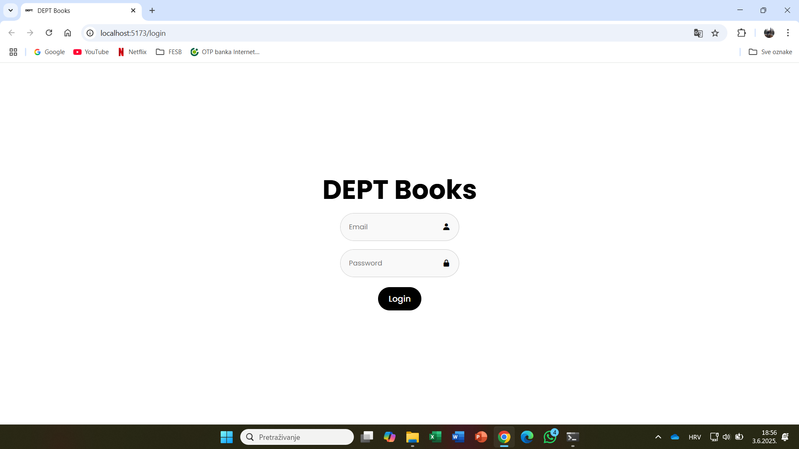
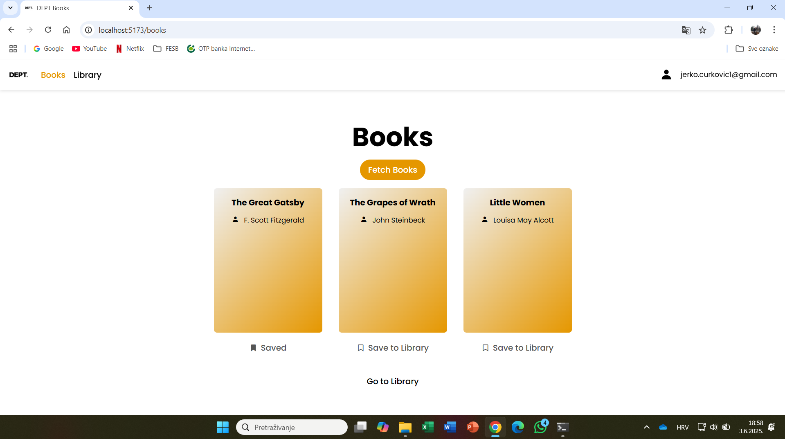
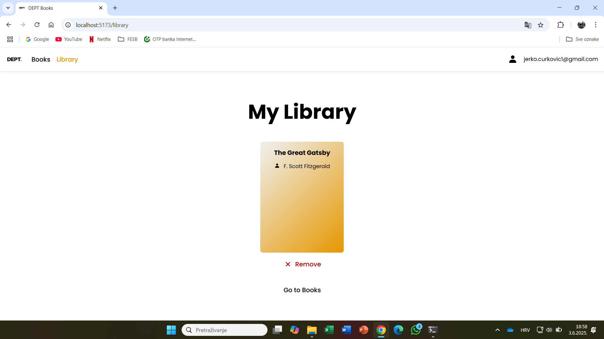

# DEPT Task

A React application that allows users to log in, fetch random books, and manage a personal library using browser local storage.

---

## Project Description

This project fulfills the task of building a **book management app** using React, based on the following requirements:

- The app is **behind a login screen** (token-based authentication).
- Users can **fetch random books** from an API.
- Books can be **saved to a library** stored in `localStorage`.
- Users can **remove books from their library**.
- App is responsive and styled for a clean user experience.

API used:  
[https://bootcamp2025.depster.me/api/books](https://bootcamp2025.depster.me/api/books)  
(secured with a Bearer token)

---

## Authentication

- The app checks for a saved token and redirects users to the login page if unauthenticated.
- On login, the token and email are stored in `localStorage`.

---

## Features

### Login Page

- Simple login form.
- Stores token and email in localStorage.  
  


---

### Books Page

- Button to fetch up to 3 random books.
- Books are displayed in styled cards.
- Each card shows title and author.
- Users can **save books** to their library.
- Already saved books show a **bold bookmark icon**.
- Clicking again **removes** the book from the library.  



---

### Library Page

- Shows all saved books in a visually consistent format.
- Each book can be **removed** from the library.
- Layout matches the Books page styling.  



---

##  How to Run

```bash
npm install
npm run dev

